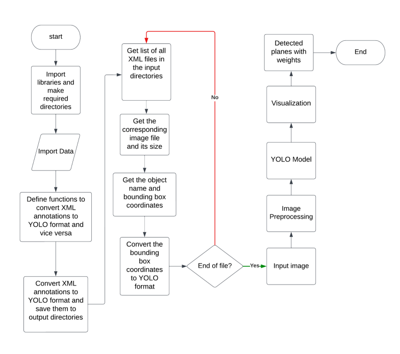

# Camouflaged Airplane Detection
This repository contains a project focused on the detection of camouflaged airplanes using machine-learning techniques. The project employs a custom dataset and utilizes YOLO (You Only Look Once) for object detection tasks. This README outlines the steps and components of the project.

# Overview
The detection of camouflaged airplanes presents unique challenges due to the airplanes' design to blend with the surrounding environment. This project aims to tackle these challenges by using advanced machine-learning techniques for object detection.


# Contents
- Restructure Files and Folders
- Convert PASCAL VOC XML to YOLO
- Explore Data
- Training Data
- Test Data
- Inference
- Restructure Files and Folders




This section explains how to organize your dataset and project files for optimal processing.

- Convert PASCAL VOC XML to YOLO:
Conversion steps to translate annotation files from PASCAL VOC XML format to YOLO format, making them compatible with YOLO object detection models.

- Explore Data:
Detailed instructions and scripts for exploring the dataset, including visualization techniques to understand the data better before training.

- Training Data: 
Guidance on preparing your training data, including splitting the dataset into training and validation sets, and recommended practices for training object detection models.

- Test Data: 
Information on evaluating the model using a separate test dataset, ensuring the model's performance is accurately assessed against unseen data.

- Inference:
Instructions on how to run the model for inference, including detecting camouflaged airplanes in new images or video streams.

# Getting Started
To get started with this project:

Requirements
- Python 3.6+
- PyTorch 1.7.1+

Other dependencies listed in requirements.txt
```python
git clone https://github.com/yourusername/camouflaged-airplane-detection.git](https://github.com/svshreya02/Camouflaged-Airplane-Detection.git
cd camouflaged-airplane-detection
pip install -r requirements.txt
```

# Usage
Provide instructions on how to use the scripts included in the repository to restructure data, convert annotations, explore the dataset, train the model, and perform inference.


# Contributing
Contributions to improve the project are welcome. Please follow the standard pull request process to submit your changes for review.

# License
Check LICENSE file
